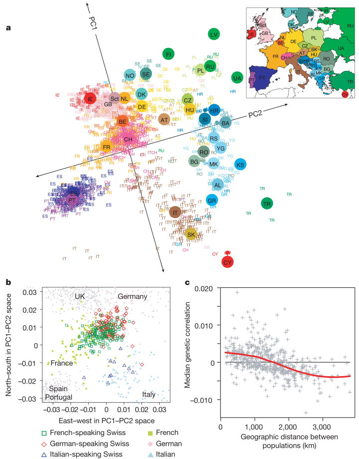

## Goal

If we think tidy: rows are observations, columns are measurements, then **dimension reduction** is the art of replacing many columns with a few carefully chosen (or constructed) columns.

. . . 

- PCA is one of many methods of dimension reduction. 
  - Other methods include *multidimensional scaling* and *t-SNE* (t-distributed stochastic neighbor embedding). 

. . . 

The goal of Principal Component Analysis is to find a lower-dimensional **linear** representation of the data that preserves as much of the total variation in the data as possible.

## Motivating example: SNP data
::::: columns
::: {.column width="50%"}
{fig-align="center" width="260"}
:::

::: {.column width="50%"}

```{r}
#| label: load-packages
#| message: false
#| warning: false
#| echo: false
library(tidyverse)
```

```{r}
#| label: snp-df
#| echo: false 
N <- 1000
snp_df <- data.frame()
for(i in 1:22) {
  snp_df <- rbind(snp_df, rbinom(n = N, size = 2, prob = 0.5))
}
colnames(snp_df) <- paste0("SNP", 1:N)
```

```{r}
#| label: echo-this-one

glimpse(snp_df)
```


:::
:::::

. . . 


How would you visualize 1000 columns?

. . . 

Create a linear combination of the columns: 

. . . 

- Component 1: 0.1 `SNP1` + 0.2 `SNP2` + 1.3 `SNP3` + 0.9 `SNP4` + 1.68 `SNP5` + $\ldots$

. . . 

- Component 2: -0.1 `SNP1` + 1.3 `SNP2` + 0.5 `SNP3` + 1.6 `SNP4` - 0.3 `SNP5` + $\ldots$

Then plot the components instead!

## Genes Mirror Geography in Europe

::::: columns
::: {.column width="50%"}
{fig-align="center" width="510"}
:::

::: {.column width="50%"}
::: {.fragment}
How were the columns chosen?
:::

::: {.fragment}
Answer: first two principal components of the covariance matrix ellipsoid!
:::

::: {.fragment}
We'll unpack this term by term.
:::
:::
:::::
## Covariance matrix

Let $X$ be a typical data matrix. 

Imagine it has 100 rows (observations) and 3 columns.

```{r}
set.seed(123)
X <- matrix(data = rnorm(300, mean = 1, sd = 0.3), nrow = 100)
dim(X)
```

::: {.fragment}
The covariance matrix tells us how each *column* (read: "variables" or "measurements") of the matrix covaries with the others. The result is a $3 \times 3$ matrix.

```{r}
#| echo: true
cov(X)
```

:::

<!-- ```{r} -->
<!-- #| echo: false -->
<!-- #| results: asis -->
<!-- Cmat <- cov(X) -->
<!-- html <- "<table style='margin:auto; border-collapse:collapse;'>" -->
<!-- for (i in 1:3) { -->
<!--   html <- paste0(html, "<tr>") -->
<!--   for (j in 1:3) { -->
<!--     val <- sprintf("%.4f", Cmat[i, j]) -->
<!--     if (i == 2 && j == 2) { -->
<!--       cell <- sprintf("<span class='fragment highlight-red'>%s</span>", val) -->
<!--     } else { -->
<!--       cell <- val -->
<!--     } -->
<!--     html <- paste0(html, "<td style='padding:10px 16px; font-family:monospace;'>", cell, "</td>") -->
<!--   } -->
<!--   html <- paste0(html, "</tr>") -->
<!-- } -->
<!-- html <- paste0(html, "</table>") -->
<!-- cat(html) -->
<!-- ``` -->

::::: columns
::: {.column width="50%"}
The diagonals tell you the variance of that column, e.g.

::: {.fragment}
```{r}
var(X[,1])
```
:::
:::

::: {.column width="50%"}
::: {.fragment}
The off-diagonals tell you how columns of your data matrix **covary**. In particular, a *positive* off-diagonal tells us that two measurements have a *positive* correlation.
:::
:::
:::::

## Manual calculation: covariance

The empirical covariance between two variables:

$$
cov(X,Y) = \frac{1}{n-1} \sum_{i = 1}^{n} (x_i - \bar{x})(y_i - \bar{y})
$$


Empirical correlation between two variables,

$$
\rho_{XY} = \frac{cov(X,Y)}{\sigma_X \sigma_Y}
$$

- $\sigma_X$ and $\sigma_Y$ are the standard deviations of the $X$ and $Y$ variables respectively.

. . . 

Notice: the covariance between $X$ and $Y$ is the same as the covariance between $Y$ and $X$. In other words: covariance matrices are **symmetric**.

# Stuff to know about matrices

## Matrices in R

::::: columns
::: {.column width="50%"}
#### Make matrices

```{r}
A <- matrix(c(1, 2, 2, 1), nrow = 2)
A
B <- matrix(c(0, 1, 0, 1), nrow = 2)
B
```
:::

::: {.column width="50%"}
#### Multiply a matrix

Matrix multiplication proceeds row by column.

```{r}
A %*% B # multiplication
```
:::
:::::

. . .

The single entry in row 1, column 1 is just a dot product:

$$\require{enclose}
\left[
\begin{array}{c}
\enclose{circle}[mathcolor="red",padding="6px"]{\begin{array}{cc}1 & 2\end{array}}\\
\begin{array}{cc}2 & 1\end{array}
\end{array}
\right]
\left[
\begin{array}{cc}
\enclose{circle}[mathcolor="red",padding="6px"]{\begin{array}{c}0\\1\end{array}} &
\begin{array}{c}0\\1\end{array}
\end{array}
\right]
=
\left[
\begin{array}{cc}
\enclose{circle}[mathcolor="red",padding="8px"]{1(0)+2(1)} & 1(0)+2(1)\\
2(0)+1(1) & 2(0)+1(1)
\end{array}
\right]$$

Same rule for every entry: choose a row, choose a column, multiply across, add up.

## Matrix and Vector Transpose

The **transpose** of a matrix (or vector) is obtained by flipping it over its main diagonal — rows become columns and columns become rows. If $A$ is an $m \times n$ matrix, then $A^T$ is $n \times m$, with $(A^T)_{ij} = A_{ji}$.

::: columns
::: {.column width="50%"}
### Matrix Transpose

$$
A =
\begin{bmatrix}
1 & 2 & 3 \\
4 & 5 & 6
\end{bmatrix}
\quad
A^T =
\begin{bmatrix}
1 & 4 \\
2 & 5 \\
3 & 6
\end{bmatrix}
$$

**In R:**

```r
A <- matrix(1:6, nrow = 2, byrow = TRUE)
A
#>      [,1] [,2] [,3]
#> [1,]    1    2    3
#> [2,]    4    5    6

t(A)
#>      [,1] [,2]
#> [1,]    1    4
#> [2,]    2    5
#> [3,]    3    6
```
:::

::: {.column width="50%"}
### Vector Transpose

$$
\mathbf{v} =
\begin{bmatrix}
7 \\
8 \\
9
\end{bmatrix}
\quad
\mathbf{v}^T =
\begin{bmatrix}
7 & 8 & 9
\end{bmatrix}
$$

**In R:**

```r
v <- c(7, 8, 9)
v
#> [1] 7 8 9

t(v)
#>      [,1] [,2] [,3]
#> [1,]    7    8    9
```
:::
:::


## Matrix vector multiplication

A vector is just a matrix with one column.

$$\require{enclose}
\left[
\begin{array}{cc}
3 & 1\\
1 & 2
\end{array}
\right]
\left[
\enclose{circle}[mathcolor="red",padding="6px"]{\begin{array}{c}2\\1\end{array}}
\right]
=
\left[
\begin{array}{c}
3(2)+1(1)\\
1(2)+2(1)
\end{array}
\right]
=
\left[
\begin{array}{c}
7\\
4
\end{array}
\right]$$

. . .

We can pre-multiply (put the vector on the left side) too:

$$\require{enclose}
\mathbf{x}^T A \mathbf{x}
=
\enclose{circle}[mathcolor="red",padding="4px"]{\begin{bmatrix}2 & 1\end{bmatrix}}
\begin{bmatrix}
3 & 1\\
1 & 2
\end{bmatrix}
\begin{bmatrix}2\\1\end{bmatrix}
=
\begin{bmatrix}2 & 1\end{bmatrix}
\begin{bmatrix}7\\4\end{bmatrix}
= 18$$

This pattern is called a **quadratic form**. It takes a direction $\mathbf{x}$ and turns it into one number.

<!-- ## Identity Matrix -->

<!-- The identity matrix has 1s on its diagonals and 0s in the off-diagonal entries. -->

<!-- ```{r} -->
<!-- identity <- diag(1, nrow = 2) -->
<!-- identity -->

<!-- A %*% identity == A -->
<!-- ``` -->

<!-- . . . -->

<!-- The identity matrix is the matrix version of multiplying by 1: -->

<!-- $$A I = A$$ -->

<!-- It is useful as a baseline: some matrices stretch, rotate, or shear vectors; the identity leaves them alone. -->

<!-- ## Positive definite -->

<!-- A symmetric matrix $A$ is **positive definite** if -->

<!-- $$\mathbf{x}^T A \mathbf{x} > 0 -->
<!-- \quad \text{for every nonzero vector } \mathbf{x}.$$ -->

<!-- . . . -->

<!-- Intuition: -->

<!-- - $\mathbf{x}^T A \mathbf{x}$ acts like a squared length after $A$ has reshaped space -->
<!-- - positive definite means every nonzero direction has positive length -->
<!-- - no direction is flattened to zero -->
<!-- - no direction has a "negative squared length" -->

## Matrix Inverses

For a $A$, with the same number of rows and columns, its **inverse** $A^{-1}$ is such that: 

$$
A^{-1}A = AA^{-1} = I
$$

::: {.fragment}
Here $I$ is called the "**identity matrix**": a square matrix with $1$s on the diagonal and $0$s everywhere else. For example, the $3 \times 3$ identity is:

$$
I = 
\begin{bmatrix}
1 & 0 & 0 \\
0 & 1 & 0 \\
0 & 0 & 1
\end{bmatrix}
$$
:::

::: {.fragment}
$I$ plays the same role for matrix multiplication that the number $1$ plays for ordinary multiplication.


- In R: `solve()` computes the matrix inverse
:::

::: {.fragment}

```{r}
A <- matrix(c(2, 1, 1, 
              1, 3, 2, 
              1, 0, 1), nrow = 3, byrow = TRUE)

A %*% solve(A)
```
:::


## Creating a covariance matrix from scratch

- `scale` lets you rescale data easily

Compare:

```{r}
X_center <- cbind(
  X[,1] - mean(X[,1]),
  X[,2] -  mean(X[,2]), 
  X[,3] - mean(X[,3])
)

X_center_2 <- scale(X, center = TRUE, scale = FALSE)

sum(X_center == X_center_2)
```

. . . 


::::: columns
::: {.column width="50%"}
Compute the covariance matrix manually:

```{r}
t(X_center) %*% X_center / 
  (nrow(X_center) - 1)
```
:::

::: {.column width="50%"}

Check equality:

```{r}
all.equal(t(X_center) %*% X_center /
            (nrow(X_center) - 1),
          cov(X))
```
:::
:::::


# Geometry of PCA

## Covariance matrix ellipsoid

A covariance matrix $\Sigma$ can be visualized by plotting the quadratic form:

$$\mathbf{x}^T \Sigma^{-1} \mathbf{x} = c$$

In two dimensions, that equation draws an ellipse.

::: panel-tabset
### Plot

```{r}
#| echo: false
#| fig-width: 6.5
#| fig-height: 4.2

source("https://sta323-fa26.github.io/scripts/stat_cov_ellipse.R")

Sigma <- matrix(c(4, 1.4, 1.4, 1), nrow = 2)

ggplot() +
  stat_cov_ellipse(sigma = Sigma, c = 4, linewidth = 1,
                    include_axes = TRUE) +
  coord_fixed() +
  theme_bw()

```


<!-- ```{r} -->
<!-- #| echo: false -->
<!-- #| fig-width: 6.5 -->
<!-- #| fig-height: 4.2 -->
<!-- A <- matrix(c(4, 1.4, -->
<!--               1.4, 1), nrow = 2) -->

<!-- level <- 4 -->
<!-- theta <- seq(0, 2 * pi, length.out = 300) -->
<!-- circle <- rbind(cos(theta), sin(theta)) -->

<!-- eig <- eigen(A) -->
<!-- ellipse <- t(eig$vectors %*% diag(sqrt(level * eig$values)) %*% circle) -->

<!-- lim <- max(abs(ellipse)) * 1.15 -->
<!-- plot(ellipse, type = "l", asp = 1, -->
<!--      xlim = c(-lim, lim), ylim = c(-lim, lim), -->
<!--      xlab = expression(x[1]), ylab = expression(x[2]), -->
<!--      main = expression(x^T * A^{-1} * x == c)) -->
<!-- abline(h = 0, v = 0, col = "gray80") -->

<!-- cols <- c("#D55E00", "#0072B2") -->
<!-- for (j in 1:2) { -->
<!--   axis_vec <- eig$vectors[, j] * sqrt(level * eig$values[j]) -->
<!--   arrows(0, 0, axis_vec[1], axis_vec[2], -->
<!--          length = 0.10, lwd = 3, col = cols[j]) -->
<!--   arrows(0, 0, -axis_vec[1], -axis_vec[2], -->
<!--          length = 0.10, lwd = 3, col = cols[j]) -->
<!-- } -->
<!-- legend("topright", legend = c("large spread", "small spread"), -->
<!--        col = cols, lwd = 3, bty = "n") -->
<!-- ``` -->

### Code

<!-- ```{r} -->
<!-- #| eval: false -->
<!-- A <- matrix(c(4, 1.4, -->
<!--               1.4, 1), nrow = 2) -->

<!-- level <- 4 -->
<!-- theta <- seq(0, 2 * pi, length.out = 300) -->
<!-- circle <- rbind(cos(theta), sin(theta)) -->

<!-- eig <- eigen(A) -->
<!-- ellipse <- t(eig$vectors %*% diag(sqrt(level * eig$values)) %*% circle) -->

<!-- lim <- max(abs(ellipse)) * 1.15 -->
<!-- plot(ellipse, type = "l", asp = 1, -->
<!--      xlim = c(-lim, lim), ylim = c(-lim, lim), -->
<!--      xlab = expression(x[1]), ylab = expression(x[2]), -->
<!--      main = expression(x^T * A^{-1} * x == c)) -->
<!-- abline(h = 0, v = 0, col = "gray80") -->

<!-- cols <- c("#D55E00", "#0072B2") -->
<!-- for (j in 1:2) { -->
<!--   axis_vec <- eig$vectors[, j] * sqrt(level * eig$values[j]) -->
<!--   arrows(0, 0, axis_vec[1], axis_vec[2], -->
<!--          length = 0.10, lwd = 3, col = cols[j]) -->
<!--   arrows(0, 0, -axis_vec[1], -axis_vec[2], -->
<!--          length = 0.10, lwd = 3, col = cols[j]) -->
<!-- } -->
<!-- legend("topright", legend = c("large spread", "small spread"), -->
<!--        col = cols, lwd = 3, bty = "n") -->
<!-- ``` -->

```{r}
#| eval: false
source("https://sta323-fa26.github.io/scripts/stat_cov_ellipse.R")

Sigma <- matrix(c(4, 1.4, 1.4, 1), nrow = 2)

ggplot() +
  stat_cov_ellipse(sigma = Sigma, c = 4, colour = "#0072B2", linewidth = 1,
                    include_axes = TRUE) +
  coord_fixed() +
  theme_bw()
```

. . . 

The principal axes of the ellipse are called the **eigenvectors** of the covariance matrix.

:::

## Exercise 1

- Create a covariance matrix and save it as an object `Sigma`. Next, simulate multivariate normal data using the following code:

```{r}
#| eval: false
mvtnorm::rmvnorm(n = 100, mean = c(0, 0), sigma = Sigma)
```

- Next, create a scatter plot of the data, and overlay the `stat_cov_ellipse` using `c = 5.99`. 

- Discuss with your neighbor.

```{r}
#| label: solution-to-exercise-1
#| echo: false
#| eval: false

Sigma = matrix(c(1, .5, .5, 1), nrow = 2)

df <- mvtnorm::rmvnorm(n = 100, mean = c(0, 0), sigma = Sigma) |>
  data.frame()
names(df) = c("x", "y")

df |>
  ggplot(aes(x = x, y = y)) +
  geom_point() +
  stat_cov_ellipse(sigma = Sigma, c = 6.28, colour = "#0072B2", linewidth = 1,
                    include_axes = TRUE) +
  theme_bw()
```


## PCA in R

For a data matrix $X$ with rows as observations and columns as variables:

1.  center each column
2.  often scale columns to comparable units
3.  run PCA

. . .

In R:

```{r}
#| eval: false
pca <- prcomp(X, center = TRUE, scale. = TRUE)
pca$x        # principal component values
```


. . . 

To view how much each variable is "loaded" onto the first principal component, the second principal component, and so forth, check:

```{r}
#| eval: false
pca$rotation
```

## PCA Summary

- "Principal components" refers to the ranked **orthogonal** axes of the ellipsoid generated from the covariance matrix of the data.

- The components are ranked largest to smallest.

- PCA is a dimension-reduction technique. Often we examine the first 1 to 3 principal components to create visualizations of high-dimensional data.

- What we gain in simplicity we often lose in interpretability. The 'dimensions' that capture the maximum variability of the data are created from linear combinations of the variables. These linear combinations are often difficult to interpret / motivate.

## Exercise 2

```{r}
library(palmerpenguins)

glimpse(penguins)
```

Consider the `palmerpenguins` data. Conduct PCA on the variables that measure physical characteristics about the penguins in `mm` or `grams`. Create a scatter plot and color by your choice of the categorical variables.

## Further reading

This lecture is inspired by 

> [Friendly, Michael, Georges Monette, and John Fox. "Elliptical insights: understanding statistical methods through elliptical geometry." (2013): 1-39.](https://arxiv.org/pdf/1302.4881.pdf)

For further reading on principal component analysis in action, see

> [Novembre, John, et al. "Genes mirror geography within Europe." Nature 456.7218 (2008): 98-101.](https://www.nature.com/articles/nature07331) 

and [an associated news article](https://www.nationalgeographic.com/science/article/european-genes-mirror-european-geography) discussing the work.
