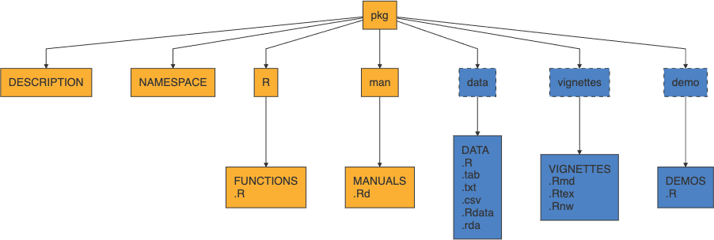

# Package logistics

## What are packages?

R packages are just a collection of files - R code, compiled code (C, C++, etc.), data, documentation, and others that live in your library path.

```{r}
.libPaths() # where all packages live
```

```{r}
dir(.libPaths()) # shows directories where individual packages live
```

## Copying your setup

`installed.packages()` lists all installed packages

```{r}
#| eval: false
myFavoritePackages <- installed.packages()
write.csv(myFavoritePackages, "myFavoritePackages.csv")
```

```{r}
#| eval: false
myFavoritePackages <- read.csv("myFavoritePackages.csv")
install.packages(myFavoritePackages[,1], dependencies = TRUE, ask = FALSE)
```

## Search path

When you run `library(pkg)`, the functions (and objects) in the package's namespace are attached to the global search path.

```{r}
search()
```

```{r}
#| message: false
#| warning: false
library(tidyverse)
search()
```

## Loading vs attaching

If you do not want to attach a package you can directly use package functions via `::`

-   useful for avoiding namespace conflicts with functions of the same name from different packages.

-   `requireNamespace()` returns `TRUE` or `FALSE` depending on if it succeeds - can be useful to test if a package is available.

```{r}
loadedNamespaces()
```

## Where do R packages come from?

{width="1050"}

## Where do R packages come from?

-   CRAN

```{r}
#| eval: false
install.packages("TeachingDemos")
```

-   GitHub

```{r}
#| eval: false
remotes::install_github("cran/TeachingDemos")
```

-   Local installation

From the terminal

```{bash}
#| eval: false
R CMD INSTALL TeachingDemos.tar.gz
```

or from R

```{r}
#| eval: false
install.packages("TeachingDemos.tar.gz", repos = NULL, type = "source")
```

. . .

Why `TeachingDemos`? See `TeachingDemos::stork`

## What is CRAN?

The Comprehensive R Archive Network which is the central repository of R packages.

-   Maintained by the R Foundation and run by a team of volunteers, \~23k packages

-   Retains all current versions of released packages as well as archives of previous versions

-   Similar in spirit to Perl’s CPAN, TeX’s CTAN, and Python’s PyPI

Some important features:

-   All submissions are reviewed by humans + automated checks

-   Strictly enforced submission policies and package requirements

-   All packages must be actively maintained and support upstream and downstream changes

## Structure of an R Package

{fig-align="center" width="2400"}

```{r}
#| echo: false
#| eval: false
library(DiagrammeR)

g <- mermaid("
graph TD
  pkg[\"pkg\"]
  pkg --> DESCRIPTION[\"DESCRIPTION\"]
  pkg --> NAMESPACE[\"NAMESPACE\"]
  pkg --> R[\"R\"]
  pkg --> man[\"man\"]
  pkg --> data[\"data\"]
  pkg --> vignettes[\"vignettes\"]
  pkg --> demo[\"demo\"]
  R --> FUNCTIONS[\"FUNCTIONS<br/>.R\"]
  man --> MANUALS[\"MANUALS<br/>.Rd\"]
  data --> DATA[\"DATA<br/>.R<br/>.tab<br/>.txt<br/>.csv<br/>.Rdata<br/>.rda\"]
  vignettes --> VIGS[\"VIGNETTES<br/>.Rmd<br/>.Rtex<br/>.Rnw\"]
  demo --> DEMOS[\"DEMOS<br/>.R\"]

  classDef yellow fill:#FBB034,stroke:#333,color:#000;
  classDef blue fill:#4D82C4,stroke:#333,color:#fff;
  classDef blue_dashed fill:#4D82C4,stroke:#333,stroke-dasharray: 5 5,color:#fff;

  class pkg,DESCRIPTION,NAMESPACE,R,man,FUNCTIONS,MANUALS yellow;
  class data,vignettes,demo blue_dashed;
  class DATA,VIGS,DEMOS blue;
")

htmlwidgets::saveWidget(g, "images/r_pkg_structure.html", selfcontained = TRUE)
webshot2::webshot("images/r_pkg_structure.html", file = "images/r_pkg_structure.png", vwidth = 1600, vheight = 1200)

img <- image_read("images/r_pkg_structure.png")
img <- image_trim(img)    # trims uniform borders automatically
image_write(img, "images/r_pkg_structure.png")

```

-   yellow is core, blue is optional (but very common)
-   `.Rd` stands for "R documentation"

## Core components

-   `DESCRIPTION` - file containing package metadata (e.g. package name, description, version, license, and author details). Also specifies package dependencies.

-   `NAMESPACE` - details which functions and objects are exported by your package.

-   `R/` - contains all R script files (`.R`) implementing package

-   `man/` - contains all R documentation files (`.Rd`)

## Optional components

The following components are optional, but quite common:

-   `tests/` - contains unit tests (`.R` scripts)

-   `src/` - contains code to be compiled (usually C / C++)

-   `data/` - contains example data sets (`.rds` or `.rda`)

-   `inst/` - contains files that will be copied to the package's top-level directory when it is installed (e.g. C/C++ headers, examples or data files that don't belong in `data/`)

-   `vignettes/` - contains long form documentation, can be static (`.pdf` or `.html`) or literate documents (e.g. `.qmd`, `.Rmd` or `.Rnw`)

## Package contents

<!-- ::: {.column width='50%'} -->

Installed Package

```{r}
fs::dir_tree(system.file(package="TeachingDemos"))
```

<!-- ::: -->

<!-- :::: -->

# Make a package

## Package development

What follows is an *opinionated* introduction to package development,

-   this is not the only way to make packages (none of the following are required)

-   I would strongly recommend using:

    -   RStudio
    -   RStudio projects
    -   GitHub
    -   usethis
    -   roxygen2

-   Read and follow along with R Packages (2e) - [Chapter 1 - "The Whole Game"](https://r-pkgs.org/whole-game.html)

# 

{fig-align="center" width="40%"}

## `usethis`

This is an immensely useful package for automating all kinds of routine (and tedious) tasks within R

-   Tools for managing git and GitHub configuration

-   Tools for managing collaboration on GitHub via pull requests (see `pr_*()`)

-   Tools for creating and configuring packages

-   Tools for configuring your R environment (e.g. `.Rprofile` and `.Renviron`)

-   and much much more

Note: the package also loads with `devtools`.

# Live demo <br/> Building a Package

## Start your package

Rather than having to remember all of the necessary pieces and their format, `usethis` can help you bootstrap your package development process.

```{r}
#| eval: false
usethis::create_package()
```

## Choosing a license

An important early step in developing a package is choosing a license - this is not trivial but is important to do early on, particularly if collaborating with others.

There are many resources available to help you choose a license, including:

::: {.center .large}
<https://choosealicense.com/>
:::

## Creating a function for the package

Create a new `.R` file in the R folder with the function name as the title. E.g. use the Newton's method code and call the file `newton`.

```{r}
newton = function(f, fp, x, tol) {
  for (i in 1:100) {
    x = x - f(x) / fp(x)
    if (abs(f(x)) < tol) {
      return(x)
    }
  }
  return(x)
}
```


## Documentation

All R packages are expected to have documentation for all *exported* functions and data sets (this is a CRAN requirement). This documentation is stored as `.Rd` files in the `man/` directory.

-   The Rd format is a markup language that is loosely based on LaTeX

-   Rd files are processed into LaTeX, HTML, and plain text when building the package

-   All packages need Rd files, that doesn't mean you need to write Rd

## Roxygen2

> The premise of roxygen2 is simple: describe your functions in comments next to their definitions and roxygen2 will process your source code and comments to automatically generate `.Rd` files in `man/`, `NAMESPACE`, and, if needed, the `Collate` field in `DESCRIPTION.`

-   roxygen uses special comment lines prefixed with `#'`

-   roxygen specific command have the format `@cmd` and mostly match `Rd` commands

-   `devtools::document()` or menu `Build > Document` with reprocess all source files and rebuild all `Rd`s

-   `usethis::create_package()` with `roxygen = TRUE` will initialize your package to use roxygen (default behavior)

## Example

```{r}
#| eval: false
#' newton
#'
#' This function takes four arguments: f, fp, x, tol and returns the root a root of f. Note that this function is sensitive to the starting point x.
#'
#'
#' @param f univariate function that you want to find the root of.
#' @param fp first derivative of function f in closed form.
#' @param x starting point
#' @param tol The tolerance term, i.e. how close the function must be to zero in order to terminate.
#' @return Returns an object of indeterminate type because the function is not robustly written.
#' @export
```

Run `devtools::document()`. 

. . . 

Check out `?newton`

# Package vigenette(s)

## Vignette

Long form documentation for your package that live in `vignette/`, use `browseVignette(pkg)` to see a package's vignettes.

-   Not required, but adds a lot of value to a package

-   Generally these are literate documents (`.Rmd`, `.Rnw`) that are compiled to `.html` or `.pdf` when the package is built.

-   Built packages retain the rendered document, the source document, and all source code

    -   `vignette("colwise", package = "dplyr")` opens rendered version

    -   `edit(vignette("colwise", package = "dplyr"))` opens code chunks

-   Use `usethis::use_vignette()` to create a RMarkdown vignette template

## Articles

These are un-official extensions to vignettes where package authors wish to include additional long form documentation that is included in their `pkgdown` site but not in the package (usually for space reasons).

-   Use `usethis::use_article()` to create

-   Files are added to `vignette/articles/` which is added to `.Rbuildignore`

- `.Rbuildignore` excludes certain files from the package build process
# Package data

## Exported data

Many packages contain sample data (e.g. `nycflights13`, `babynames`, etc.)

Generally these files are made available by saving a single data object as an `.Rdata` file (using `save()`) into the `data/` directory of your package.

-   An easy option is to use `usethis::use_data(obj)` to create the necessary file(s)

-   Data is usually compressed, for large data sets it may be worth trying different options (there is a 5 Mb package size limit on CRAN)

-   Exported data must be documented (possible via roxygen)

## Lazy data

By default when attaching a package all of that packages data is loaded - however if `LazyData: true` is set in the packages' `DESCRIPTION` then data is only loaded when used.

. . .

::: small
```{r}
pryr::mem_used()
```
:::

. . .

::: small
```{r}
library(nycflights13)
pryr::mem_used()
```
:::

. . .

::: small
```{r}
invisible(flights)
pryr::mem_used()
```
:::

If you use `usethis::use_data()` this option will be set in `DESCRIPTION` automatically.

## Raw data

When published, a package should generally only contain the final data set, but it is important that the process to generate the data is documented as well as any necessary preliminary data.

-   These can live any where but the general suggestion is to create a `data-raw/` directory which is ignored via `.Rbuildignore`

-   `data-raw/` then contain scripts, data files, and anything else needed to generate the final object

-   See examples [babynames](https://github.com/hadley/babynames) or [nycflights](https://github.com/hadley/nycflights13)

-   Use `usethis::use_data_raw()` to create and ignore the `data-raw/` directory.

## Internal data

If you have data that you want to have access to from within the package but not exported then it needs to live in a special Rdata object located at `R/sysdata.rda`.

-   Can be created using `usethis::use_data(obj1, obj2, internal = TRUE)`

-   Each call to the above will overwrite, so needs to include all objects

-   Not necessary for small data frames and similar objects - just create in a script. Use when you want the object to be compressed.

-   Example [nflplotR](https://github.com/nflverse/nflplotR/tree/main/R) which contains team logos and colors for NFL teams.

## Raw data files

If you want to include raw data files (e.g `.csv`, shapefiles, etc.) there are generally placed in `inst/` (or a nested folder) so that they are installed with the package.

-   Accessed using `system.file("dir", package = "package")` after install

-   Use folders to keep things organized, Hadley recommends and uses `inst/extdata/`

-   Example [sf](https://github.com/r-spatial/sf/tree/master/inst)

# Package checking

## `R CMD check`

Last time we saw the usage of `R CMD check`, or rather `Build > Check Package` from within RStudio.

This is a good idea to run regularly to make sure nothing is broken and you are meeting the important package quality standards, but this only in the context of your machine, your version of R, your OS, and so on.

If using GitHub it is highly recommended that you run `usethis::use_github_action_check_standard()` to enable GitHub actions checks of the package each time it is pushed.

On each push this runs R CMD check on: \* Latest R on MacOS, Windows, Linux (Ubuntu) \* Previous and development version of R on Linux (Ubuntu)

# Package testing

## Basic test structure

Package tests live in `tests/`,

-   Any R scripts found in the folder will be run when checking the package (not Building)

-   Generally tests fail on errors, but warnings are also tracked

-   Testing is possible via base R, including comparison of output vs. a file but it is not recommended (See [Writing R Extensions](https://cran.r-project.org/doc/manuals/r-release/R-exts.html#Package-subdirectories))

-   Note that R CMD check also runs all documentation examples (unless explicitly tagged dont run) - which can be used for basic testing

## testthat basics

Not the only option but probably the most widely used and with the best integration into RStudio.

Can be initialized in your project via `usethis::use_testthat()` which creates `tests/testthat/` and some basic scaffolding.

-   `test/testthat.R` is what is run by R CMD Check and runs your other tests - handles some basic config like loading package(s)

-   Test scripts go in `tests/testthat/` and should start with `test_`, suffix is usually the file in `R/` that is being tested.

::: callout-note
Build > Test Package to run the package tests. Example:

```{r}
#| eval: false
f1 = function(x) {
  x^2
}
fp1 = function(x) {
  2 * x
}

stopifnot(
newton(f1, fp1, x = 1, tol = 0.00001) == 0.001953125
)

```

:::

::: aside
`usethis::use_testthat()` has an edition argument, this is a way of maintaining backwards compatibility, generally always use the latest edition if starting a new project
:::

## testthat script structure

From the bottom up,

-   a single test is written as an expectation (e.q. `expect_equal()`, `expect_error()`, etc.)

-   multiple related expectations are combined into a test group (`test_that()`), which provides

    -   a human readable name and
    -   local scope to contain the expectations and any temporary objects

-   multiple test groups are combined into a file

# Installing the package

## How to

After building, you will see `package_name_version.tar.gz` appear in the parent directory.

We can install with 

```{r}
#| eval: false
install.packages("pkg_name_and_version.tar.gz", repos = NULL, type = "source")
```


